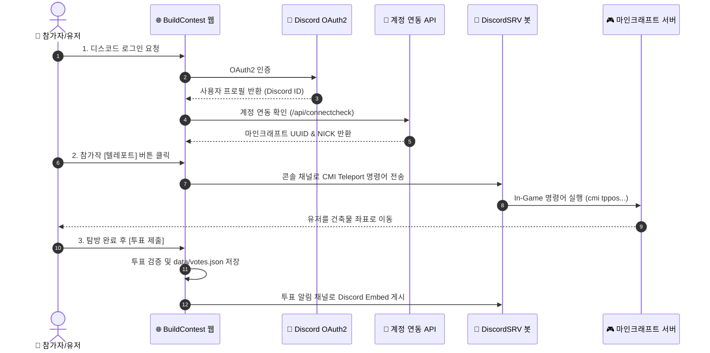

<div align="center">

# 🏆 N월 마인크래프트 건축 공모전 Web Platform

<p align="center">
  <b>마인크래프트 서버와 연동되는 올인원 건축 공모전 & 투표 웹 플랫폼</b>
</p>

[](https://vite.dev/)
[](https://expressjs.com/)
[](https://react.dev/)
[](https://discord.js.org/)
[](https://nodejs.org/)
[](LICENSE)

<br />

[주요 기능](#-주요-기능) •
[서비스 아키텍처](#-서비스-아키텍처--흐름) •
[빠른 시작](#-빠른-시작) •
[어드민 설정 가이드](#-어드민-설정-가이드) •
[데이터 저장 구조](#-데이터-저장-구조)

</div>

---

## 📌 개요

**BuildContest**는 마인크래프트 서버에서 정기적으로 개최되는 건축 공모전을 원활하게 운영하고 관리할 수 있도록 설계된 웹 플랫폼입니다.

참가자는 **디스코드 로그인**을 통해 본인의 마인크래프트 계정을 연동하고, 웹에서 참가작들을 클릭해 **게임 내 텔레포트**로 둘러본 후 투표를 진행할 수 있습니다. 

별도의 데이터베이스(RDBMS/NoSQL) 설치 없이 파일 기반(`data/` JSON)으로 가볍게 동작하며, 모든 설정과 운영 조작은 **웹 어드민 패널(` /admin `)**에서 손쉽게 수행할 수 있습니다.

---

## ✨ 주요 기능

### 🔐 1. 디스코드 OAuth2 & 계정 연동
- **디스코드 소셜 로그인**: OAuth2 기반 손쉬운 로그인 지원
- **마인크래프트 계정 연동 API**: 디스코드 ID를 마인크래프트 UUID로 자동 매핑하여 본인 확인
- **특정 디스코드 서버(길드) 제한**: 지정한 디스코드 서버 멤버만 로그인 가능하도록 보안 설정 제공

### 🏰 2. 인게임 텔레포트 연동 (Teleport Integration)
- **DiscordSRV 봇 콘솔 통합**: 웹에서 텔레포트 버튼 클릭 시, 콘솔 채널로 `cmi tppos` 또는 맞춤형 커맨드를 즉시 발송
- **유연한 치환자 지원**: `{player}`, `{uuid}`, `{x}`, `{y}`, `{z}`, `{yaw}`, `{pitch}`, `{world}` 지원
- **연타 방지 쿨다운 & 필수 방문 시스템**: 모든 작품을 탐방해야 투표가 열리는 탐방 필수 옵션 제공

### 🗳️ 3. 스마트 투표 엔진 (Voting Engine)
- **자유로운 투표 규칙**: 1인당 최대 투표 수, 시작/종료 일시, 본인 작품 투표 방지, 제출 후 수정 허용
- **건축가 익명 옵션**: 공모 기간 동안 건축가 닉네임을 익명 처리하여 공정한 투표 유도
- **실시간 득표 상태 개방/비공개**: 실시간 현황 공개 여부 제어
- **디스코드 채널 알림**: 투표 제출 시 지정된 디스코드 채널로 실시간 알림 임베드 게시

### ⚙️ 4. 완벽한 웹 어드민 패널 (`/admin`)
- **초기 비밀번호 자동 등록**: 첫 접속 시 비밀번호 생성 후 보안 관리
- **참가작 등록/수정/순서 변경**: 다중 이미지 갤러리(전체화면 줌), 게임 내 좌표 자동 추출(Paste & Fill)
- **투표 현황 & CSV 내보내기**: 실시간 순위표 조회 및 데이터 엑셀 내보내기
- **시즌 초기화 & 스냅샷 보관함**: 지난 공모전 결과 자동 스냅샷(최근 24회차) 보관 및 손쉬운 회차 넘기기

### 🎨 5. 애플 스타일의 모던 UI & 레트로 픽셀 감성
- **Pretendard & Galmuri11 폰트 조합**: 가독성 높은 현대적 폰트와 마인크래프트 픽셀 타이틀 폰트 조화
- **라이트 / 다크 모드**: OS 설정에 맞춘 테마 자동 전환
- **커스텀 디자인 브랜딩**: 어드민에서 로고 URL, 메인 히어로 배경 이미지, 배경 블러 및 어둡기 슬라이더 실시간 조절

---

## 🔄 서비스 아키텍처 & 흐름



---

## 🚀 빠른 시작

### 📋 요구 사항
- **Node.js**: `v20.9.0` 이상
- **npm**: `v10.0.0` 이상

### 📦 설치 및 실행

```bash
# 1. 저장소 클론
git clone https://github.com/dariring/buildcontest.git
cd buildcontest

# 2. 의존성 패키지 설치
npm install

# 3. 개발 서버 실행 (Quick Development)
npm run dev

# 4. 프로덕션 빌드 & 실행 (Production)
npm start
```

실행 후 브라우저에서 `http://localhost:3000` 에 접속하세요.  
최초 어드민 설정은 `http://localhost:3000/admin` 에 접속하여 비밀번호를 지정한 후 진행합니다.

### 새 서버에 한 번에 설치하기 (Ubuntu / Debian)

VM 을 새로 만들었다면 아래 한 줄이면 Node 설치부터 서비스 등록까지 끝납니다.

```bash
git clone https://github.com/dariring/buildcontest.git
cd buildcontest
sudo ./scripts/install.sh --domain contest.example.com
```

스크립트가 하는 일:

| 단계 | 내용 |
|---|---|
| 1 | Node.js 22 설치 (이미 20 이상이면 건너뜀) |
| 2 | 로그인 불가 전용 계정 `buildcontest` 생성 |
| 3 | `/opt/buildcontest` 에 소스 배치 → 의존성 설치 → 클라이언트 빌드 |
| 4 | `data/` 를 `700` 으로 잠그고 실행 설정(`.env`) 작성 |
| 5 | systemd 서비스 등록·기동 후 실제 응답까지 확인 |
| 6 | cloudflared 설치 및 연결 안내 |

Cloudflare Zero Trust 에서 커넥터 토큰을 미리 받아두었다면 터널 연결까지 한 번에 됩니다.

```bash
sudo ./scripts/install.sh --domain contest.example.com --cloudflared-token eyJhIjoi...
```

주요 옵션은 `--port`, `--dir`, `--user`, `--branch`, `--skip-cloudflared` 이며 `--help` 로 전체를 볼 수 있습니다.

> [!TIP]
> **업데이트도 같은 명령입니다.** 다시 실행하면 최신 소스를 받아 다시 빌드하고 서비스를 재시작합니다. `data/` 와 `.env` 는 건드리지 않습니다.

설치가 끝나면 아래 명령으로 다룹니다.

```bash
sudo systemctl status buildcontest     # 상태
sudo journalctl -u buildcontest -f     # 실시간 로그
sudo systemctl restart buildcontest    # 재시작
sudo nano /opt/buildcontest/.env       # 설정 변경 (변경 후 재시작)
```

> [!WARNING]
> 터널을 연결한 직후 바로 `/admin` 에 접속해 관리자 비밀번호를 정하세요. **먼저 접속한 사람이 관리자가 됩니다.**

---

## 🛠️ 어드민 설정 가이드

처음 `/admin` 페이지에 접속하면 **관리자 비밀번호**를 등록하는 화면이 표시됩니다. 비밀번호 설정 후 아래 각 탭에서 상세 설정을 채워넣습니다. (`.env` 파일 설정 불필요)

> [!NOTE]
> 모든 설정값은 `data/config.json`에 안전하게 저장됩니다.

### 1️⃣ 디스코드 탭
| 설정 항목 | 설명 & 획득 경로 |
| :--- | :--- |
| **Client ID / Client Secret** | [Discord Developer Portal](https://discord.com/developers/applications) → 앱 선택 → OAuth2 메뉴에서 발급 |
| **리디렉션 URL** | 기본 접속 주소로 자동 생성 (예: `http://localhost:3000/api/auth/callback`). 디스코드 개발자 포털의 Redirects 설정에 등록 필수 |
| **서버(길드) ID** | 입력 시 해당 디스코드 서버의 멤버만 로그인 허용 (비워둘 경우 제약 없음) |
| **봇 토큰** | Discord Developer Portal → Bot → Reset Token 으로 발급받은 토큰 |
| **콘솔 채널 ID** | DiscordSRV 콘솔 채널 ID. 웹에서 발송하는 텔레포트 커맨드가 실행되는 채널 |
| **투표 알림 채널 ID** | 투표 제출 시 실시간 알림 임베드가 올려질 채널 ID |

> [!IMPORTANT]
> 봇 계정은 콘솔 채널과 알림 채널 모두에 **메시지 보내기(Send Messages)** 권한이 부여되어 있어야 합니다.

### 2️⃣ 계정 연동 탭
- **API 주소**: `http://100.77.77.90:3000` (기본값)
- **확인 경로**: `/api/connectcheck`
- **x-admin-key**: 연동 서버의 `ADMIN_PASSWORD` 키 값
- **연결 테스트**: 디스코드 ID를 입력하여 마인크래프트 UUID가 정상적으로 응답하는지 즉시 검증 가능

### 3️⃣ 텔레포트 탭
참가자가 웹에서 [텔레포트] 버튼 클릭 시 콘솔 채널로 전송될 명령어 템플릿입니다.

```bash
cmi tppos {x} {y} {z} {yaw} {pitch} {world} -t:{player}
```

- **사용 가능한 치환자**: `{player}`, `{uuid}`, `{x}`, `{y}`, `{z}`, `{yaw}`, `{pitch}`, `{world}`
- **연타 방지 Cooldown**: 버튼 연타를 방지하기 위한 쿨다운 (기본 3초)
- **전체 필수 탐방 옵션**: 켜 둘 경우 모든 참가작을 텔레포트로 탐방해야 투표 제출 버튼이 활성화됩니다.

### 4️⃣ 투표 설정 탭
- 1인당 투표 수 (기본 3표)
- 공모전 시작 및 종료 시각 (서버 시간대 기준)
- 본인 작품 투표 허용 여부 & 제출 후 수정 허용 여부
- 실시간 득표수 개방 여부

### 5️⃣ 공모전 & 브랜딩 탭
- 공모전 연도/월 및 제목 (`{year}`, `{month}` 치환자 활용)
- 메인 공지 배너 및 안내 문구
- **시그니처 강조 색상 (Primary Color)**: 기본값 `#c9873b` (버튼, 프로그레스 바, 선택 효과 일괄 적용)
- **로고 & 히어로 배경**: 외부 이미지 URL 지정, 블러 및 어둡기 슬라이더로 비주얼 맞춤 설정

---

## 📁 프로젝트 & 데이터 저장 구조

BuildContest는 별도의 DB 서버 구축 없이 `data/` 디렉터리에 JSON 파일로 상태를 관리합니다.

```
buildcontest/
├── public/                 # 로고, 파비콘 및 정적 에셋
├── index.html              # SPA 진입 문서 (제목·색상은 서버가 채웁니다)
├── vite.config.js          # 클라이언트 번들 설정
├── src/
│   ├── client/             # Vite + React 프론트엔드
│   │   ├── main.jsx        # 진입점 (경로에 따라 Home / Admin 렌더)
│   │   ├── pages/          # Home(공모전), Admin(관리자 패널)
│   │   └── components/     # UI 컴포넌트
│   └── server/             # Express 백엔드
│       ├── index.js        # 서버 진입점 (API + 정적 파일 + SPA 폴백)
│       ├── html.js         # index.html 에 설정값 주입
│       ├── routes/         # auth, state, vote, teleport, admin
│       └── lib/            # 설정, 저장소, 세션, 디스코드 봇, 연동 API
├── dist/                   # 빌드 결과물 (Git 제외 대상)
├── data/                   # ⚠️ 영구 데이터 저장소 (Git 제외 대상)
│   ├── config.json         # 시스템 설정, 어드민 암호 해시, 세션 키
│   ├── participants.json   # 공모전 참가작 정보
│   ├── votes.json          # 투표 기록
│   ├── progress.json       # 사용자별 텔레포트 탐방 기록
│   ├── archives.json       # 지난 회차 스냅샷 보관함
│   └── namecache.json      # Mojang API UUID ↔ Nickname 캐시
└── package.json
```

> [!WARNING]
> `data/` 폴더에는 봇 토큰 및 어드민 암호 해시 등의 중요 정보가 포함되어 있으므로 `.gitignore`에 등록되어 있습니다. 서버 이동 시 `data/` 폴더를 통째로 백업/복사하면 모든 데이터가 유지됩니다.

---

## 🎨 디자인 시스템 (Design System)

- **Typography**:
  - `Pretendard`: 본문, 제목, 버튼, 어드민 레이아웃 전반
  - `Galmuri11-Bold`: 메인 헤더 타이틀, 참가작 순번 배지, 마인크래프트 레트로 강조 카운터
- **Theme Support**: System Light & Dark Mode 자동 전환
- **Dynamic Styling**: 어드민에서 지정한 브랜드 테마 컬러가 웹사이트 전체 액센트 요소로 실시간 연동

---

## ⚙️ 배포 및 환경 설정 팁

- **포트 변경**: `PORT=4000 npm start`
- **바인딩 주소 변경**: `HOST=127.0.0.1 npm start` (기본값은 `0.0.0.0`)
- **데이터 폴더 경로 변경**: `BUILDCONTEST_DATA_DIR=/custom/path npm start`
- **리버스 프록시 (HTTPS)**: NGINX / Cloudflare 등을 이용해 HTTPS를 적용하고, 디스코드 개발자 포털의 Redirect URI와 어드민의 **리디렉션 URL**을 실제 도메인 주소로 맞춰주어야 디스코드 로그인이 정상 작동합니다.
- **프록시 뒤에 둘 때는 `BUILDCONTEST_TRUST_PROXY=1 npm start`**: 이 값을 켜야 세션 쿠키에 `Secure` 가 붙고, 로그인 시도 제한이 프록시 IP 하나가 아니라 실제 접속자별로 계산됩니다. 프록시 없이 서버를 직접 노출하는 경우에는 절대 켜지 마세요. 접속자가 헤더를 위조해 IP를 속일 수 있습니다.

### 환경 변수 정리

| 변수 | 기본값 | 설명 |
|---|---|---|
| `PORT` | `3000` | 수신 포트 |
| `HOST` | `0.0.0.0` | 바인딩 주소. 터널/프록시를 쓴다면 `127.0.0.1` 로 좁히세요 |
| `BUILDCONTEST_DATA_DIR` | `./data` | 데이터 저장 폴더 |
| `BUILDCONTEST_TRUST_PROXY` | (꺼짐) | 프록시 뒤일 때 `1`. `x-forwarded-*` 를 신뢰합니다 |
| `BUILDCONTEST_PUBLIC_ORIGIN` | (자동) | 밖에서 보이는 실제 주소. 프록시가 Host 헤더를 바꿔서 넘길 때 지정 |

---

## ☁️ Cloudflare Tunnel 로 공개하기

포트 개방이나 공인 IP 없이 서비스할 수 있고, HTTPS 인증서도 Cloudflare 가 처리합니다.
아래는 수동 설정 기준이며, [설치 스크립트](#새-서버에-한-번에-설치하기-ubuntu--debian)를 쓰면 이 과정이 자동으로 처리됩니다.

**1. 터널 설정** (`~/.cloudflared/config.yml`)

```yaml
tunnel: <터널 ID>
credentials-file: /경로/<터널 ID>.json

ingress:
  - hostname: contest.example.com
    service: http://127.0.0.1:3000
  - service: http_status:404
```

> [!IMPORTANT]
> `httpHostHeader` 는 설정하지 마세요. 이 값을 넣으면 브라우저가 보낸 `Origin` 과 서버가 받는 `Host` 가 서로 달라져, 위조 요청을 걸러내는 출처 검사에 정상 요청까지 막힙니다(모든 저장·투표가 403). 꼭 써야 한다면 아래 `BUILDCONTEST_PUBLIC_ORIGIN` 을 함께 지정하세요.

**2. 앱 실행**

```bash
HOST=127.0.0.1 BUILDCONTEST_TRUST_PROXY=1 BUILDCONTEST_PUBLIC_ORIGIN=https://contest.example.com npm start
```

- `HOST=127.0.0.1` — 터널을 통해서만 접근할 수 있게 막습니다. 이걸 빼면 같은 네트워크에서 Cloudflare 를 우회해 직접 접속할 수 있고, 그 경로로 들어온 요청은 접속자 IP 위조도 가능해집니다.
- `BUILDCONTEST_TRUST_PROXY=1` — Cloudflare 가 붙여주는 실제 접속자 IP와 `https` 정보를 신뢰합니다. 켜야 세션 쿠키에 `Secure` 가 붙고 로그인 시도 제한이 접속자별로 계산됩니다.
- `BUILDCONTEST_PUBLIC_ORIGIN` — 출처 검사와 디스코드 콜백 주소의 기준을 공개 도메인으로 고정합니다. `Host` 헤더를 위조해도 콜백 주소가 바뀌지 않습니다.

**3. 디스코드 설정**

Discord Developer Portal → OAuth2 → Redirects 에 `https://contest.example.com/api/auth/callback` 을 등록합니다. 어드민의 **리디렉션 URL** 은 비워두면 위 공개 주소 기준으로 자동 생성됩니다.

**4. 캐시**

앱이 알아서 헤더를 내려주므로 Cloudflare 쪽에 따로 설정할 것은 없습니다. 해시가 붙은 정적 파일(`/assets/*`)은 1년 캐시로 엣지에 얹히고, HTML 과 모든 API 응답은 `no-store` 라 캐시되지 않습니다. 다만 Cache Rules 에서 **Cache Everything 을 켜지 마세요.** 로그인한 사람의 페이지가 다른 사람에게 그대로 나갈 수 있습니다.

---

## 📄 라이선스 (License)

This project is licensed under the [MIT License](LICENSE).

